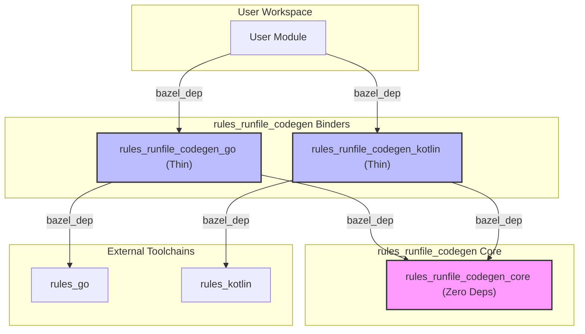
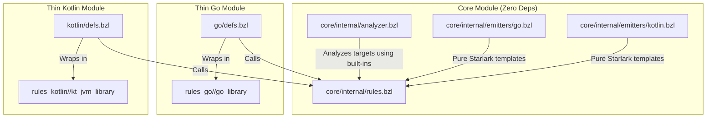

# Design Plan: rules_runfile_codegen

We will design and implement a set of Bzlmod modules that generate language-specific (Go and Kotlin) libraries to safely load runfile data. This eliminates the need for users to hardcode runfile paths in their application code.

## Requirements

| ID | Requirement | Priority | Design Coverage |
| :--- | :--- | :--- | :--- |
| **REQ-1** | **Type-Safe Symbols** | High | Generate language-specific libraries exposing runfiles as typed symbols instead of raw strings. |
| **REQ-2** | **Multi-Language** | High | Support Go and Kotlin initially, designed to easily extend to other languages (Python, Java, etc.). |
| **REQ-3** | **Minimal Dependencies** | High | One Bzlmod module per language so users only pull in dependencies for the languages they use. |
| **REQ-4** | **Robust Path Resolution** | High | Correctly resolve runfiles across module boundaries (external dependencies) without hardcoding `_main`. |
| **REQ-5** | **Executable Runfiles** | High | Support runfiles that are executables, ensuring they and their dependencies are available and executable by the parent. |
| **REQ-6** | **Discoverability (UX)** | Low | Provide a way (`bazel run :target_usage`) to easily discover available symbols and get copy-pasteable usage examples. |

---

## Proposed Directory Structure

We will use a single Git repository (monorepo) containing multiple Bzlmod modules. This allows us to keep the codebase together while publishing separate, minimal modules for each language.

```
rules_runfile_codegen/ (Repo Root)
├── repo/
│   ├── core/             # Core Module (Dependency-free)
│   │   ├── MODULE.bazel
│   │   ├── BUILD.bazel
│   │   └── internal/
│   │       ├── BUILD.bazel
│   │       ├── analyzer.bzl   # Target analysis & validation
│   │       ├── rules.bzl      # Core runfile_codegen rule
│   │       └── emitters/
│   │           ├── go.bzl     # Go code emitter
│   │           └── kotlin.bzl # Kotlin code emitter
│   ├── go/               # Go Binder Module (Thin)
│   │   ├── MODULE.bazel
│   │   ├── BUILD.bazel
│   │   └── defs.bzl          # Public macros (delegates to core)
│   ├── kotlin/           # Kotlin Binder Module (Thin)
│   │   ├── MODULE.bazel
│   │   ├── BUILD.bazel
│   │   └── defs.bzl          # Public macros (delegates to core)
│   └── tests/                 # Integration tests
│       ├── go/
│       └── kotlin/
└── scratch_test/              # Scratch space (sibling)
```

---

## Architecture Overview

To support multiple languages without dependency bloat, the project is split into a **Core** module (containing all analysis and code generation logic, with zero dependencies) and **Thin Binder** modules (which bind the core generator to specific language rulesets).

### 1. Bzlmod Dependency Graph (Resolution Time)
This diagram shows how the modules depend on each other at the Bzlmod level. Note that a Go-only user never pulls in Kotlin dependencies, and vice-versa, preserving **REQ-3 (Minimal Dependencies)**.


*(Note: During local development, because Bzlmod `local_path_override` is non-transitive, users must override `rules_runfile_codegen_core` in their root `MODULE.bazel` alongside the binders).*

### 2. Starlark Call & Build Graph (Analysis/Build Time)
This diagram shows how the Starlark macros in the thin binders call the core generator rule and wrap the generated source file into the final library target.



---

## Bzlmod & Publishing Strategy

The project is designed to be fully compatible with publishing to the Bazel Central Registry (BCR) as separate modules:
*   **`rules_runfile_codegen_core`**: The dependency-free core generator.
*   **`rules_runfile_codegen_go`**: The thin Go binder.
*   **`rules_runfile_codegen_kotlin`**: The thin Kotlin binder.

By splitting the project into separate modules, we ensure that users only pull in the dependencies they need (e.g., Go users do not pull in Kotlin/Java toolchains), respecting **REQ-3 (Minimal Dependencies)**.

For details on how to configure Bzlmod for local development and testing, see the **[Developer Guide](file:///usr/local/google/home/reddaly/tcode/runfile-codegen/repo/DEV_GUIDE.md)**.

---

## Go Module Design

### User Experience (Usage Example)

From the user's perspective, they define a `go_runfile_library` in their `BUILD.bazel` using the `go_runfile` helper.

To ensure **early failure**, all runfiles are resolved at `init()` time (program startup), and the program will panic immediately if any runfile is missing. *(Note: This behavior may be configurable in the future, pending further design.)* The library exposes **rich `Runfile` and `ExecutableRunfile` objects**.

#### 1. Declaring the dependency in `BUILD.bazel`

```python
load("@rules_runfile_codegen_go//go:defs.bzl", "go_runfile_library", "go_runfile")

go_runfile_library(
    name = "my_resources",
    package = "github.com/example/project/path/to/myapp/my_resources",
    entries = [
        # Case 1: Simple local data file (Go style: ConfigJSON)
        go_runfile(
            name = "ConfigJSON",
            target = "//path/to:config.json",
            doc = "The main configuration file for the application, loaded at startup.",
        ),
        # Case 2: Data file from a different repository
        go_runfile(
            name = "ExternalSchema",
            target = "@shared_schemas//json:config_schema.json",
            doc = "The JSON schema used to validate the configuration file.",
        ),
        # Case 3: Executable target (not self-contained, has its own runfiles)
        go_runfile(
            name = "HelperTool",
            target = "//path/to/tools:complex_helper",
            doc = "A helper tool used for complex data processing subprocesses.",
        ),
    ],
)
```

#### 2. Using the generated symbols in `main.go`

```go
package main

import (
	"fmt"
	"log"
	"os"

	// Import the generated library
	"github.com/example/project/path/to/myapp/my_resources"
)

func main() {
	// Case 1: Simple local data file
	// We call .Path() to get the pre-resolved absolute path.
	configPath := my_resources.ConfigJSON.Path()
	fmt.Printf("Loading local config from: %s\n", configPath)
	configContent, _ := os.ReadFile(configPath)

	// Case 2: Data file from a different repository
	schemaPath := my_resources.ExternalSchema.Path()
	fmt.Printf("Loading external schema from: %s\n", schemaPath)

	// Case 3: Executable target (not self-contained)
	// .Cmd() automatically propagates the runfiles env!
	cmd := my_resources.HelperTool.Cmd()
	cmd.Stdout = os.Stdout
	cmd.Stderr = os.Stderr

	fmt.Printf("Running helper tool...\n")
	if err := cmd.Run(); err != nil {
		log.Fatalf("Helper tool failed: %v", err)
	}
}
```

### Generated Go Code Structure

```go
// Code generated by rules_runfile_codegen. DO NOT EDIT.
package my_resources

import (
	"fmt"
	"os"
	"os/exec"
	"github.com/bazelbuild/rules_go/go/runfiles"
)

// Runfile represents a resolved runfile.
type Runfile struct {
	absPath string
}

// Path returns the resolved absolute path of the runfile.
func (r Runfile) Path() string {
	return r.absPath
}

// ExecutableRunfile represents a resolved executable runfile.
type ExecutableRunfile struct {
	Runfile
}

// Cmd returns an *exec.Cmd pre-configured to run this executable,
// with the Bazel runfiles environment variables already propagated.
func (e ExecutableRunfile) Cmd(args ...string) *exec.Cmd {
	cmd := exec.Command(e.absPath, args...)
	if env, err := runfiles.Env(); err == nil {
		cmd.Env = append(os.Environ(), env...)
	}
	return cmd
}

var (
	// ConfigJSON is the main configuration file for the application, loaded at startup.
	// Source: //path/to:config.json
	ConfigJSON Runfile

	// ExternalSchema is the JSON schema used to validate the configuration file.
	// Source: @shared_schemas//json:config_schema.json
	ExternalSchema Runfile

	// HelperTool is a helper tool used for complex data processing subprocesses.
	// Source: //path/to/tools:complex_helper
	HelperTool ExecutableRunfile
)

func init() {
	reg, err := runfiles.New()
	if err != nil {
		panic(fmt.Sprintf("failed to initialize runfiles: %v", err))
	}

	ConfigJSON = mustResolve(reg, "workspace/path/to/config.json")
	ExternalSchema = mustResolve(reg, "shared_schemas/json/config_schema.json")
	HelperTool = mustResolveExecutable(reg, "workspace/path/to/tools/complex_helper")
}

func mustResolve(reg *runfiles.Runfiles, rlocationPath string) Runfile {
	absPath, err := reg.Rlocation(rlocationPath)
	if err != nil {
		panic(fmt.Sprintf("failed to resolve runfile %q: %v", rlocationPath, err))
	}
	return Runfile{absPath: absPath}
}

func mustResolveExecutable(reg *runfiles.Runfiles, rlocationPath string) ExecutableRunfile {
	absPath, err := reg.Rlocation(rlocationPath)
	if err != nil {
		panic(fmt.Sprintf("failed to resolve executable runfile %q: %v", rlocationPath, err))
	}
	return ExecutableRunfile{Runfile{absPath: absPath}}
}
```

---

## Kotlin Module Design

### User Experience (Usage Example)

For Kotlin, the macro generates a `kt_jvm_library` using the `kt_runfile` helper. 

The generated `Runfile` objects expose the resolved path as a **`String`** or a modern **`java.nio.file.Path`**. This avoids legacy API bloat while providing the most common representations. Users can easily convert the `Path` to a `java.io.File` via `.toFile()` if needed.

#### 1. Declaring the dependency in `BUILD.bazel`

```python
load("@rules_runfile_codegen_kotlin//kotlin:defs.bzl", "kt_jvm_runfile_library", "kt_runfile")

kt_jvm_runfile_library(
    name = "my_resources",
    package = "com.example.project.myapp.resources",
    entries = [
        # Case 1: Simple local data file (Kotlin style: camelCase)
        kt_runfile(
            name = "configJson",
            target = "//path/to:config.json",
            doc = "The main configuration file for the application, loaded at startup.",
        ),
        # Case 2: Data file from a different repository
        kt_runfile(
            name = "externalSchema",
            target = "@shared_schemas//json:config_schema.json",
            doc = "The JSON schema used to validate the configuration file.",
        ),
        # Case 3: Executable target (not self-contained)
        kt_runfile(
            name = "helperTool",
            target = "//path/to/tools:complex_helper",
            doc = "A helper tool used for complex data processing subprocesses.",
        ),
    ],
)
```

#### 2. Using the generated symbols in `Main.kt`

```kotlin
package com.example.project.myapp

import java.nio.file.Files
// Import the generated object
import com.example.project.myapp.resources.MyResources

fun main() {
    // Case 1: Simple local data file
    // We can use the .path property (String) or convert the .jvmPath to a File if needed
    val configPath = MyResources.configJson.path
    println("Loading local config from: $configPath")
    val configFile = MyResources.configJson.jvmPath.toFile()
    val configContent = configFile.readText()

    // Case 2: Data file from a different repository
    // We use the .jvmPath property (java.nio.file.Path) for modern Java NIO APIs
    val schemaPath = MyResources.externalSchema.jvmPath
    println("Loading external schema from: $schemaPath")
    val schemaContent = Files.readString(schemaPath)

    // Case 3: Executable target (not self-contained)
    // .processBuilder() automatically propagates the runfiles env!
    val process = MyResources.helperTool.processBuilder()
        .redirectOutput(ProcessBuilder.Redirect.INHERIT)
        .redirectError(ProcessBuilder.Redirect.INHERIT)
        .start()

    val exitCode = process.waitFor()
    if (exitCode != 0) {
        throw RuntimeException("Helper exited with code $exitCode")
    }
}
```

### Generated Kotlin Code Structure

The Kotlin `Runfile` class exposes `path` (`String`) and `jvmPath` (`java.nio.file.Path`).

```kotlin
// Code generated by rules_runfile_codegen. DO NOT EDIT.
package com.example.project.myapp.resources

import com.google.devtools.build.runfiles.Runfiles

object MyResources {
    /**
     * The main configuration file for the application, loaded at startup.
     * Source: //path/to:config.json
     */
    val configJson: Runfile

    /**
     * The JSON schema used to validate the configuration file.
     * Source: @shared_schemas//json:config_schema.json
     */
    val externalSchema: Runfile

    /**
     * A helper tool used for complex data processing subprocesses.
     * Source: //path/to/tools:complex_helper
     */
    val helperTool: ExecutableRunfile

    open class Runfile(val path: String) {
        fun getPath(): String = path

        /**
         * Returns the resolved path as a java.nio.file.Path.
         * Uses java.nio.file.Paths.get() for Java 8 compatibility.
         */
        val jvmPath: java.nio.file.Path by lazy { java.nio.file.Paths.get(path) }
    }

    class ExecutableRunfile(path: String) : Runfile(path) {
        /**
         * Returns a ProcessBuilder pre-configured to run this executable,
         * with the Bazel runfiles environment variables already propagated.
         */
        fun processBuilder(vararg args: String): ProcessBuilder {
            val pb = ProcessBuilder(path, *args)
            pb.environment().putAll(Runfiles.create().envVars)
            return pb
        }
    }

    init {
        val runfiles = Runfiles.create()
        configJson = mustResolve(runfiles, "workspace/path/to/config.json")
        externalSchema = mustResolve(runfiles, "shared_schemas/json/config_schema.json")
        helperTool = mustResolveExecutable(runfiles, "workspace/path/to/tools/complex_helper")
    }

    private fun mustResolve(runfiles: Runfiles, rlocationPath: String): Runfile {
        val absPath = runfiles.rlocation(rlocationPath) 
            ?: throw RuntimeException("Failed to resolve runfile: $rlocationPath")
        return Runfile(absPath)
    }

    private fun mustResolveExecutable(runfiles: Runfiles, rlocationPath: String): ExecutableRunfile {
        val absPath = runfiles.rlocation(rlocationPath) 
            ?: throw RuntimeException("Failed to resolve executable runfile: $rlocationPath")
        return ExecutableRunfile(absPath)
    }
}
```

---

## Path Resolution Robustness & Implementation Details

How the generator rules handle different target types, grounded in the [Official Bazel Runfiles Specification](https://bazel.build/extending/rules#runfiles):

1.  **Determining Runfile Paths in the Generator Rule**:
    The private generator rule determines the runfile path of each target by inspecting its `File` object in the rule implementation. This aligns with how Bazel structures the runfiles tree:
    *   For a target, we get its primary output file (e.g., `target.files.to_list()[0]`).
    *   We inspect `file.short_path`.
    *   If `short_path` starts with `../`, it belongs to an external repository. We strip `../` to get the correct runfile path (e.g., `../repo_name/path/to/file` becomes `repo_name/path/to/file`).
    *   If `short_path` does not start with `../`, it belongs to the main repository. We prepend the workspace name: `ctx.workspace_name + "/" + short_path`.
    *   This is extremely robust, handles external repositories natively (supporting Bzlmod repository mapping), and does not rely on fragile string parsing in Starlark macros.
2.  **Automatic Executable Detection**:
    In the private generator rule, we inspect `target[DefaultInfo].files_to_run` for each entry. If `files_to_run.executable` is not `None`, we mark the entry as executable. The generator then emits the `ExecutableRunfile` type instead of `Runfile` for that entry.
3.  **Transitive Runfiles**: By passing the list of targets to the `data` attribute of the underlying `go_library` or `kt_jvm_library`, Bazel automatically handles collecting all transitive runfiles (including those of executable targets like `complex_helper`) and making them available at runtime, as per the [Bazel Data Dependencies Spec](https://bazel.build/concepts/dependencies#data-dependencies).
4.  **Env Propagation for Subprocesses**: The helper methods (`Cmd()` in Go, `processBuilder()` in Kotlin) use the official language-specific runfiles libraries (`rules_go/go/runfiles` and `rules_java`'s `Runfiles`) to propagate the necessary environment variables (like `RUNFILES_DIR` and `RUNFILES_MANIFEST_FILE`). This is the officially mandated way to ensure child processes can locate their own runfiles, especially on platforms like Windows where symlinks may not be available and manifests are used.

---

## Appendix A: Public Macro Starlark Implementation

To keep the API design clean, the Starlark implementation details for the public macros are documented here. They act as thin binders that delegate to the core `runfile_codegen` rule.

### Go Helper Macro `go_runfile`

```python
def go_runfile(name, target, doc = ""):
    """Helper to define a Go runfile entry with documentation.

    Args:
        name: The Go variable name (should be Go-idiomatic, e.g. ConfigJSON).
        target: The Bazel target (Label).
        doc: A description of the runfile, used for Go docstrings.
    """
    return {
        "name": name,
        "target": target,
        "doc": doc,
    }
```

### Kotlin Helper Macro `kt_runfile`

```python
def kt_runfile(name, target, doc = ""):
    """Helper to define a Kotlin runfile entry with documentation.

    Args:
        name: The Kotlin property name (should be Kotlin-idiomatic, e.g. configJson).
        target: The Bazel target (Label).
        doc: A description of the runfile, used for KDocs.
    """
    return {
        "name": name,
        "target": target,
        "doc": doc,
    }
```

### Go Macro (`go_runfile_library`)

```python
load("@rules_go//go:def.bzl", "go_library")
load("@rules_runfile_codegen_core//internal:rules.bzl", "runfile_codegen")

def go_runfile_library(name, importpath, entries, **kwargs):
    if "srcs" in kwargs:
        fail("Cannot specify 'srcs' in go_runfile_library, they are generated automatically.")

    # Extract parallel lists for the generator rule
    names = [e["name"] for e in entries]
    targets = [e["target"] for e in entries]
    docs = [e["doc"] for e in entries]

    # Propagate testonly and tags
    testonly = kwargs.get("testonly", None)
    tags = kwargs.get("tags", None)

    # Merge data and deps
    user_data = kwargs.pop("data", [])
    user_deps = kwargs.pop("deps", [])

    # Call the core generator rule
    runfile_codegen(
        name = name + "_codegen",
        package = importpath,
        language = "go",
        names = names,
        targets = targets,
        docs = docs,
        testonly = testonly,
        tags = tags,
    )

    # Public Go library
    go_library(
        name = name,
        srcs = [":" + name + "_codegen"],
        importpath = importpath,
        deps = [
            "@rules_go//go/runfiles",
        ] + user_deps,  # Merge deps
        data = targets + user_data,  # Merge data
        **kwargs
    )
```

### Kotlin Macro (`kt_jvm_runfile_library`)

```python
load("@rules_kotlin//kotlin:jvm.bzl", "kt_jvm_library")
load("@rules_runfile_codegen_core//internal:rules.bzl", "runfile_codegen")

def kt_jvm_runfile_library(name, package, entries, object_name = None, **kwargs):
    if "srcs" in kwargs:
        fail("Cannot specify 'srcs' in kt_jvm_runfile_library, they are generated automatically.")

    # Derive object_name if not provided
    if not object_name:
        # Sanitize name to make it a valid PascalCase Kotlin identifier
        clean_name = ""
        for char in name.elems() if hasattr(name, "elems") else name:
            if char.isalnum() or char == "_":
                clean_name += char
            else:
                clean_name += "_"

        # Split by underscore and capitalize
        parts = [part.capitalize() for part in clean_name.split("_") if part]
        object_name = "".join(parts)

        if not object_name:
            fail("Target name '%s' contains no valid characters for a Kotlin object name." % name)
        if object_name[0].isdigit():
            object_name = "_" + object_name

    # Extract parallel lists for the generator rule
    names = [e["name"] for e in entries]
    targets = [e["target"] for e in entries]
    docs = [e["doc"] for e in entries]

    # Propagate testonly and tags
    testonly = kwargs.get("testonly", None)
    tags = kwargs.get("tags", None)

    # Merge data and deps
    user_data = kwargs.pop("data", [])
    user_deps = kwargs.pop("deps", [])

    # Call the core generator rule
    runfile_codegen(
        name = name + "_codegen",
        package = package,
        language = "kotlin",
        object_name = object_name,
        names = names,
        targets = targets,
        docs = docs,
        testonly = testonly,
        tags = tags,
    )

    # Public Kotlin library
    kt_jvm_library(
        name = name,
        srcs = [":" + name + "_codegen"],  # Use the generator target directly
        deps = [
            "@bazel_tools//tools/java/runfiles",
        ] + user_deps,
        data = targets + user_data,
        **kwargs
    )
```

---

## Appendix B: Handling Multi-File Targets and Filegroups

During the design process, we analyzed how to handle Bazel targets that produce multiple files (such as `filegroup` or `genrule` with multiple outputs) and whether they should be mapped to a single symbol.

### Classification of Target Outputs

Bazel targets can be categorized by their outputs at analysis time:
1.  **Single-File Targets**: Targets producing exactly one file (e.g., a source file, a single-output `genrule`).
2.  **Executable Targets**: Targets producing a runnable binary (e.g., `go_binary`). They are resolved via their primary executable file.
3.  **Directory Targets (TreeArtifacts)**: Targets producing a single directory whose contents are unknown at analysis time (e.g., a code generator output folder).
4.  **File Collections (e.g., `filegroup`)**: Targets grouping multiple files that *are* known at analysis time. Crucially, a `filegroup` is **not** a directory; at runtime, the files remain at their individual package paths in the runfiles tree.

### Design Options Considered

#### Option 1: Strict Single-File/Directory Constraint (Chosen)
We enforce that any target mapped to a symbol must resolve to **exactly one file** or **exactly one directory**.
*   **Behavior**: If a target (like a `filegroup` or `genrule`) produces multiple files, the generator rule fails the build at analysis time with a clear error.
*   **How to use `filegroup`**: A `filegroup` is only allowed if it contains exactly one file. If it contains multiple files, the user cannot target the `filegroup` itself. Instead, they must target the individual files within the group directly as separate entries.
*   **Rationale**: This keeps the mapping strictly `Symbol -> Single Path`, which is clean, type-safe, and easy to understand. It avoids the need for complex collection types in the generated API.

#### Option 2: Generate Collections (Rejected)
We could allow multi-file targets and generate a collection (list or map) of `Runfile` objects in the target language.
*   **Behavior**: A `filegroup` with `a.txt` and `b.txt` would generate `var MyGroup []Runfile`.
*   **Reasons for Rejection**:
    *   **Loss of Type Safety**: Accessing files by index (`MyGroup[0]`) is brittle and prone to runtime errors if the order of files in the `filegroup` changes.
    *   **Complexity**: Significantly complicates the generator implementation and the generated API.
    *   **Conceptual Mismatch**: A `filegroup` is not a directory, so exposing it as a single entity in code is often misleading. Exposing individual files as distinct symbols is much clearer.

---

## Versioning & Compatibility Strategy

A key benefit of the "Thin Binders + Core Generator" architecture is the ability to decouple the release cycles of the core generator from the language-specific binders. To ensure long-term maintainability, we adopt the following strategy for handling toolchain and runtime library versions.

### 1. Version-Aware Emitters (Core-Side Logic)
The core generator (`runfile_codegen` rule) is designed to be version-aware. If a language's runtime library or toolchain introduces breaking changes, the core generator should handle the compatibility logic internally, rather than forcing a fork of the generator.

*   **Version Attributes**: The `runfile_codegen` rule accepts optional version attributes (e.g., `rules_go_version`, `rules_kotlin_version` or a generic `runtime_version`).
*   **Conditional Emission**: The language-specific emitters in `core/internal/emitters/` use these version strings to conditionally generate different code structures.
*   *Example*: If a future version of `rules_go` changes the `runfiles.New()` API, the Go emitter in core can check the version and emit the appropriate initialization code:
    ```python
    # core/internal/emitters/go.bzl
    def emit_go(package, entries, rules_go_version):
        # ...
        if semver_compare(rules_go_version, "<", "1.0.0"):
            # Emit old API usage
        else:
            # Emit new API usage
    ```

### 2. Bzlmod Version Compatibility (MVS)
By leveraging Bzlmod's Minimal Version Selection (MVS), we can ensure that:
*   **Core is Backward-Compatible**: The `rules_runfile_codegen_core` module will strictly adhere to semantic versioning. Newer versions of `core` will always support the Starlark APIs and version flags required by older versions of the binders.
*   **Independent Upgrades**: A user can upgrade their `rules_runfile_codegen_go` binder to get support for a new `rules_go` version, which might pull in a newer `core` transitively, without affecting their `rules_runfile_codegen_kotlin` binder (which continues to use the same `core` compatibility paths).

### 3. Maximizing API Stability
To minimize the need for version-specific emitter logic:
*   **Stable Runtime APIs**: The generated code should always prefer the most stable, long-lived APIs of the underlying runtime libraries (e.g., `@bazel_tools//tools/java/runfiles` for Java/Kotlin, which is extremely stable).
*   **Minimal Generated Surface**: We keep the generated API surface as small as possible (only exposing `Path()` and execution helpers), reducing the likelihood of breaking changes in the generated code itself.

---

## References

*   **[Official Bazel Runfiles Guide](https://bazel.build/extending/rules#runfiles)**: The canonical guide on how runfiles are declared, structured, and passed via the `DefaultInfo` provider.
*   **[Bazel Runfiles Library Documentation](https://bazel.build/reference/be/general#runfiles)**: Details on the `rlocation` path resolution contract and how language-specific libraries resolve paths.
*   **[Bazel Data Dependencies](https://bazel.build/concepts/dependencies#data-dependencies)**: Explanation of how the `data` attribute behaves and how transitive runfiles are collected.
*   **[Fabian Meumertzheim's BazelCon Talk: "Runfiles and where to find them"](https://www.youtube.com/watch?v=F69Ng7q8Jli)**: The de facto community reference for how runfiles work internally across different platforms (symlinks vs. manifests) and how to use them safely.

---

## Verification Plan

### Automated Tests
We will set up integration tests in `repo/tests`:
1.  **Go Integration Test**:
    *   A `go_runfile_library` target.
    *   A `go_test` that depends on it and asserts that the files can be loaded and their contents match.
2.  **Kotlin Integration Test**:
    *   A `kt_jvm_runfile_library` target.
    *   A `kt_jvm_test` that depends on it and asserts the same.
3.  **Multi-module Integration Test**:
    *   A separate test workspace that imports our local modules via `local_path_override` to verify that they work correctly when consumed as external dependencies (critical for the `_main` vs `module_name` runfile path issue).

### Manual Verification
*   We will run `bazel run //path/to:my_runfiles_usage` and verify the output is helpful and correct.
